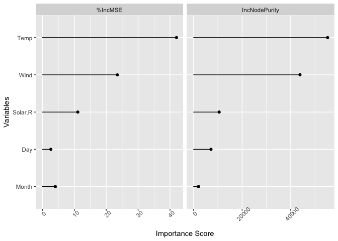

treezy
======

Makes handling decision trees easy. Treezy.

Decision trees are very commonly used in statistics and data science, but sometimes getting the information out of them can be a bit difficult. I had written some helper functions for dealing with decision trees in my personal repository [neato](www.github.com/njtierney/neato), and thought it would be nice to formalise these into their own package and see how it develops.

**This package is very much in a beta stage, so please use it with that in mind**

<!-- * Badges for Travis-CI (and any other badges) -->
<!-- README.md is generated from README.Rmd. Please edit that file -->
Installation instructions
=========================

Currently only available on GitHub

``` r

# install.packages("devtools")
devtools::install_github("njtierney/treezy")
```

Example usage
=============

Explore variable importance with `importance_table` and `importance_plot`
-------------------------------------------------------------------------

### rpart

``` r

library(treezy)
library(rpart)

fit_rpart_kyp <- rpart(Kyphosis ~ ., data = kyphosis)
```

``` r

# default method for looking at importance

# table
fit_rpart_kyp$variable.importance
#>    Start      Age   Number 
#> 8.198442 3.101801 1.521863

# plot
fit_rpart_kyp$variable.importance
#>    Start      Age   Number 
#> 8.198442 3.101801 1.521863

# with treezy

importance_table(fit_rpart_kyp)
#> # A tibble: 3 x 2
#>   variable importance
#>     <fctr>      <dbl>
#> 1    Start   8.198442
#> 2      Age   3.101801
#> 3   Number   1.521863

importance_plot(fit_rpart_kyp)
```


``` r

# extend and modify
library(ggplot2)
importance_plot(fit_rpart_kyp) + 
    theme_bw() + 
    labs(title = "My Importance Scores",
         subtitle = "For a CART Model")
```


### randomForest

It also works for randomForest

``` r
library(randomForest)
#> randomForest 4.6-12
#> Type rfNews() to see new features/changes/bug fixes.
#> 
#> Attaching package: 'randomForest'
#> The following object is masked from 'package:ggplot2':
#> 
#>     margin
set.seed(131)
fit_rf_ozone <- randomForest(Ozone ~ ., 
                             data = airquality, 
                             mtry=3,
                             importance=TRUE, 
                             na.action=na.omit)
  
print(fit_rf_ozone)
#> 
#> Call:
#>  randomForest(formula = Ozone ~ ., data = airquality, mtry = 3,      importance = TRUE, na.action = na.omit) 
#>                Type of random forest: regression
#>                      Number of trees: 500
#> No. of variables tried at each split: 3
#> 
#>           Mean of squared residuals: 303.8304
#>                     % Var explained: 72.31

## Show "importance" of variables: higher value mean more important:

# randomForest has a better importance method than rpart
importance(fit_rf_ozone)
#>           %IncMSE IncNodePurity
#> Solar.R 11.092244     10534.237
#> Wind    23.503562     43833.128
#> Temp    42.027171     55218.049
#> Month    4.070413      2032.652
#> Day      2.632496      7173.194

## use importance_table
importance_table(fit_rf_ozone)
#> # A tibble: 5 x 3
#>   variable   %IncMSE IncNodePurity
#>     <fctr>     <dbl>         <dbl>
#> 1  Solar.R 11.092244     10534.237
#> 2     Wind 23.503562     43833.128
#> 3     Temp 42.027171     55218.049
#> 4    Month  4.070413      2032.652
#> 5      Day  2.632496      7173.194

# now plot it
importance_plot(fit_rf_ozone)
```



Known issues
============

treezy is in a VERY beta stage at the moment, so please use with caution. Here are a few things to keep in mind

-   The functions **have not been made compatible with GBM**, but this is on the cards. This was initially written for some old code which used gbm.
-   The partial dependence plots have not been tested, and were initially intended for use with gbm.step, as in the [elith et al. paper](https://cran.r-project.org/web/packages/dismo/vignettes/brt.pdf)

Future work
===========

-   Extend to other kinds of decision trees (gbm, and more)
-   provide tools for extracting out other decision tree information (decision tree rules, etc).
